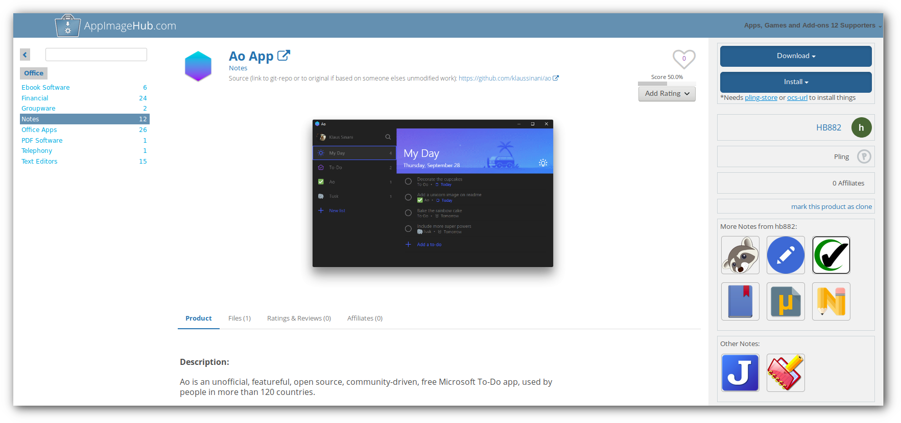
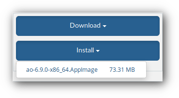
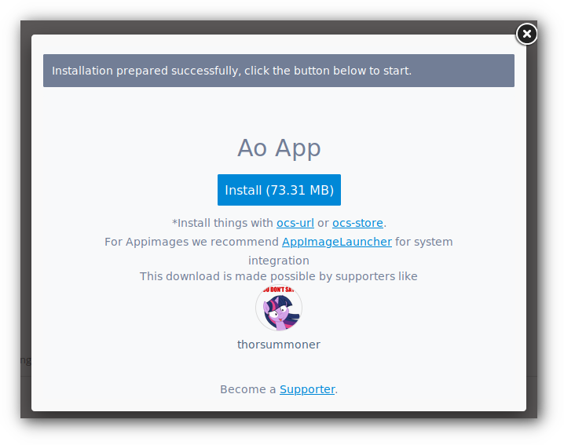
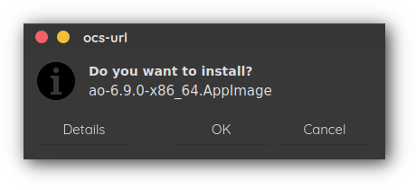
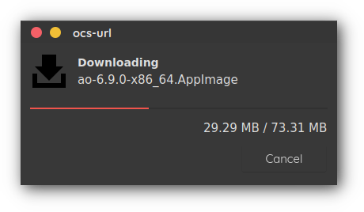
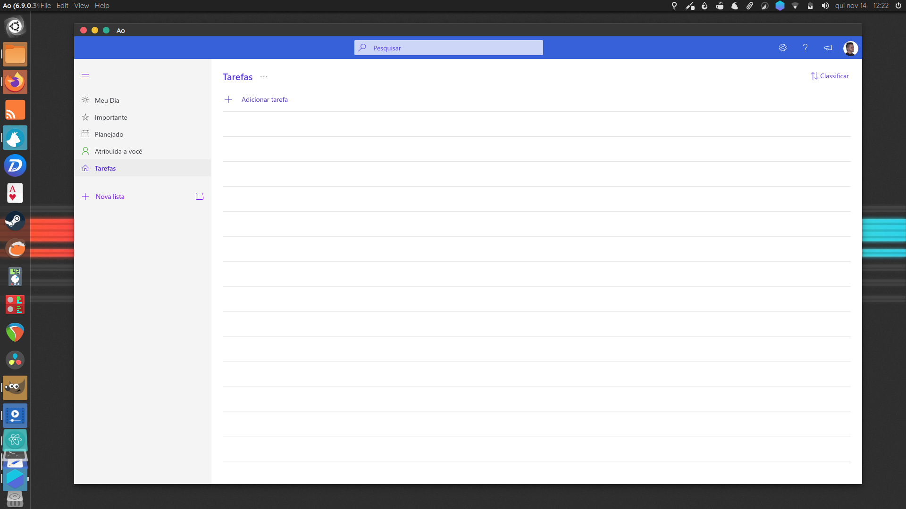

### Integração automática de AppImage

Para instalar programas empacotados no formato [**AppImage**](https://appimage.org/) no **Unity XP** é muito simples, basta _acessar a página de download do programa_, baixar o pacote e assim que o download é concluído, o programa já estará disponível no menu automaticamente, **nenhum passo adicional é necessário**.

Mas se você gosta de manter seus arquivos bem organizados e não quer deixar os programas na pasta de downloads, pode utilizar o método a seguir, os arquivos **AppImage** ficarão _salvos_ na pasta `~/.local/bin`

Acesse o site **https://appimagehub.com** e navegue até a página do programa que deseja instalar:

Clique em **Install** e em seguida clique no nome do arquivo que será exibido abaixo:

Cheque o tamanho do arquivo que será baixado e clique em **Install** novamente:

Uma janela do [**OCS-URL**](https://www.pling.com/s/OpenSuse-Packages/p/1136805/) será exibida, clique em **OK**:

Após esses passos, é só aguardar a conclusão do download.

O programa estará disponível no _dash_ do **Unity XP**.

